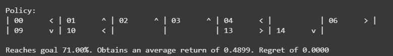
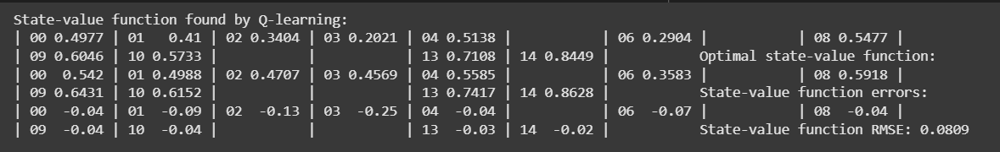
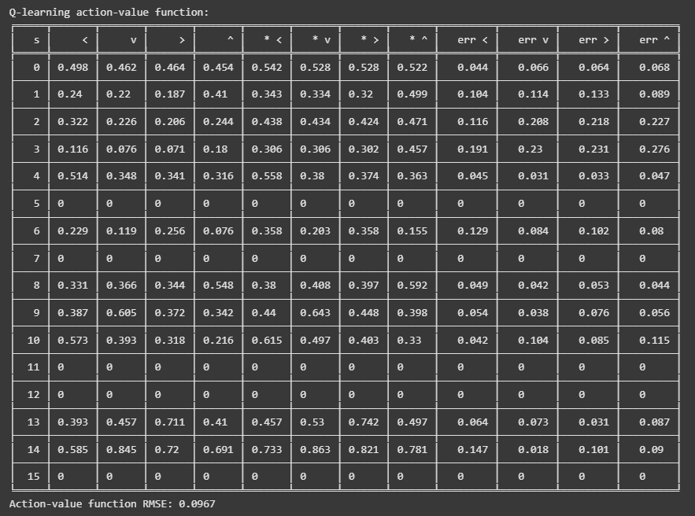
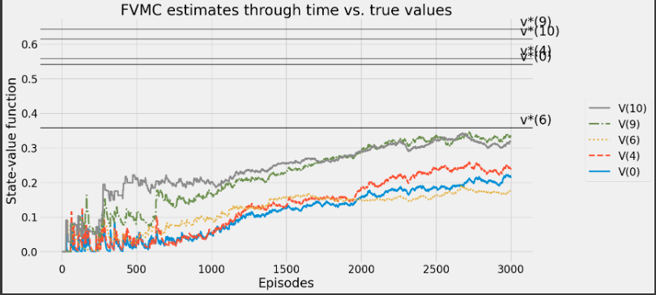
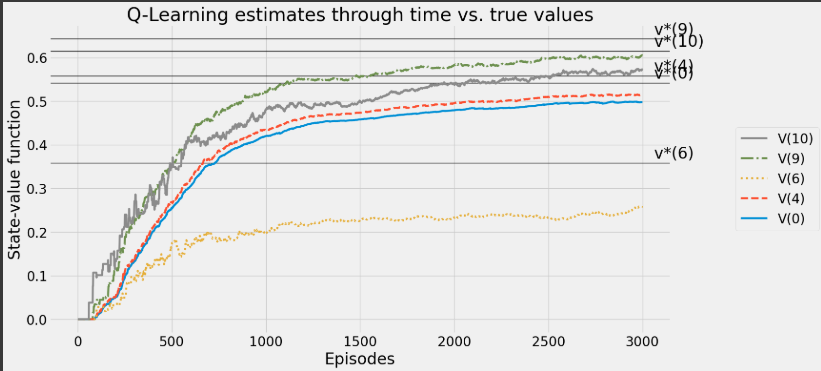

# Q Learning Algorithm


## AIM
To develop a Python program to find the optimal policy for the given RL environment using Q-Learning and compare the state values with the Monte Carlo method.


## PROBLEM STATEMENT
To find the optimal policy for the RL environment using Q-Learning algorithm 

## Q LEARNING ALGORITHM
### Step1:
Initialize Q-values for all state-action pairs and set up epsilon and alpha decay schedules.

### Step2:
For each episode, select actions using an epsilon-greedy policy and update Q-values using the TD error.

### Step3:
Track policy and Q-values after each episode, then compute the value function and derive the final policy.

## Q LEARNING FUNCTION
### Name: Shaik Shoaib Nawaz
### Register Number: 212222240094
```
def q_learning(env,
               gamma=1.0,
               init_alpha=0.5,
               min_alpha=0.01,
               alpha_decay_ratio=0.5,
               init_epsilon=1.0,
               min_epsilon=0.1,
               epsilon_decay_ratio=0.9,
               n_episodes=3000):
    nS, nA = env.observation_space.n, env.action_space.n
    pi_track = []
    Q = np.zeros((nS, nA), dtype=np.float64)
    Q_track = np.zeros((n_episodes, nS, nA), dtype=np.float64)

    # Write your code here
    select_action=lambda state, Q, epsilon: np.argmax(Q[state]) \
        if np.random.random() > epsilon \
        else np.random.randint(len(Q[state]))
    alphas=decay_schedule(init_alpha,min_alpha,alpha_decay_ratio,n_episodes)
    epsilons=decay_schedule(init_epsilon,min_epsilon,epsilon_decay_ratio,n_episodes)
    for e in tqdm(range(n_episodes), leave=False):
      state,done=env.reset(),False
      while not done:
        action=select_action(state,Q,epsilons[e])
        next_state,reward,done,_=env.step(action)
        td_target=reward+gamma*Q[next_state].max()*(not done)
        td_error=td_target-Q[state][action]
        Q[state][action]=Q[state][action]+alphas[e]*td_error
        state=next_state
      Q_track[e]=Q
      pi_track.append(np.argmax(Q,axis=1))
    V=np.max(Q,axis=1)
    pi=lambda s:{s:a for s,a in enumerate(np.argmax(Q,axis=1))}[s]

    return Q, V, pi, Q_track, pi_track
```


## OUTPUT:






## RESULT:
Thus, The Python program to find the optimal policy for the RL environment using Q-Learning and comparing the state values with the Monte Carlo method is executed successfully.


